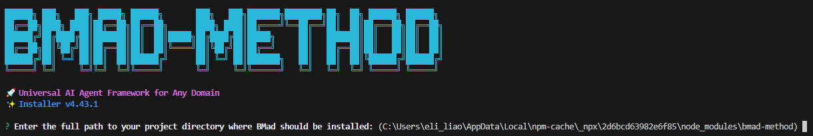

# BMad-Method
BMAD，全名是《Breakthrough Method for Agile AI-Driven Development》 (突破性敏捷 AI 驅動開發方法)。  
它不僅僅是一個編碼工具，而是一個全面、以流程為導向的框架。  
它的核心理念在於「AI 即團隊」，透過多個專業化的 AI 代理來模擬一個完整的敏捷開發團隊。  


# 安裝 BMad-Method
```bash
npx bmad-method install
```

```bash
Enter the full path to your project directory where BMad should be installed:
```
如果已在專案底下的執行目錄，就輸入 `./` 即可。

---

```
? Select what to install/update (use space to select, enter to continue): (Press <space> to select, <a> to toggle all, <i> to invert selection, and <enter> to proceed)
>(*) BMad Agile Core System (v4.43.1) .bmad-core
 ( ) Phaser 3 2D Game Dev Pack (v1.13.0) .bmad-2d-phaser-game-dev
 ( ) Unity C# 2D Game Dev Pack (v1.6.0) .bmad-2d-unity-game-dev
 ( ) Creative Writing Studio (v1.1.1) .bmad-creative-writing
 ( ) Godot Game Dev Pack (v1.0.0) .bmad-godot-game-dev
 ( ) Infrastructure DevOps Pack (v1.12.0) .bmad-infrastructure-devops
```

## Select
```bash
Select what to install/update
```
選擇的核心系統和擴充包：

## BMad Agile Core System

這是 BMad Method 的核心系統，包含所有基礎 AI 代理和工作流程。  
安裝後會新增 .bamd-core/ 目錄，包含以下內容：  

- 核心的代理：業務分析師、產品經理、系統架構師、敏捷教練、開發者、QA 工程師
- 任務工作流程和文件模板
- 配置文件和知識庫
## Phaser 3 2D Game Dev Pack

這是遊戲開發的擴充包，專門用在 Phaser3 框架的 2D 遊戲開發，安裝後會新增 .bmad-2d-phaser-game-dev/ 目錄  

## Unity C# 2D Game Dev Pack

這是 Unity 遊戲開發擴展包，專門用於 Unity 引擎的 2D 遊戲開發，包含以下內容：  

- 遊戲設計師和遊戲開發者代理
- Unity 專用的任務和模板
- C# 和 Unity 最佳實踐指南
## Infrastructure DevOps Pack

這是基礎設施和 DevOps 擴展包，用於雲端基礎設施和 DevOps 工作流程，包含：  

- DevOps 專家代理
- 基礎設施架構模板
- 雲端部署和監控工具

---

依照專案的需求安裝擴充包，如果沒有其他的需求，只要選「BMad Agile Core System」即可。  

---

```bash
📋 Document Organization Settings
Configure how your project documentation should be organized.

? Will the PRD (Product Requirements Document) be sharded into multiple files? Yes
? Will the architecture documentation be sharded into multiple files? Yes
```
```bash
📋 文件組織設置
配置專案文檔的組織方式。

？產品需求文件 (PRD) 會被拆分成多個文件嗎？是
？架構文檔會被拆分成多個文件嗎？是
```
選擇 YES 時，表示這些文件會被拆分成多個獨立的文件，存放在各自的目錄中 (docs/prd/ 或 docs/architecture/)，好處是當敏捷教練 agent 在建立故事時，就可以精確引用 PRD 中特定的 epic 文件，提供更聚焦的上下文。而架構師的文件也會被自動載入到開發代理的上下文中。  

### 什麼是 epic?
在 BMad Method 中，epic 是產品需求文檔 (PRD) 中的一個重要概念。  
epic 是一個功能的集合，包含多個相關的用戶故事，同時也代表一個完整的、可部署的功能增量。  

---

簡單來說，就是建議大家都選擇 YES，因為這樣會提供更好的開發體驗。  
所有 agent 可以載入特定的文件，而不是一整份大文件，因此能有效利用上下文窗口提供更精確的技術指導。  

## 選 IDE 工具
```
🛠️  IDE Configuration
 ⚠️  IMPORTANT: This is a MULTISELECT! Use SPACEBAR to toggle each IDE!
🔸 Use arrow keys to navigate
🔸 Use SPACEBAR to select/deselect IDEs
🔸 Press ENTER when finished selecting

? Which IDE(s) do you want to configure? (Select with SPACEBAR, confirm with ENTER): (Press <space> to select, <a> to toggle all, <i> to invert selection, and <enter> to proceed)
 ( ) Gemini CLI
 ( ) Qwen Code
 ( ) Crush
>( ) Github Copilot
 ( ) Auggie CLI (Augment Code)
 ( ) Codex CLI
 ( ) Codex Web
(Move up and down to reveal more choices)
```
這邊我選 Github Copilot(`<space>`選取，`<enter>`繼續下一步)。  

---

```bash
🛠️  IDE Configuration
 ⚠️  IMPORTANT: This is a MULTISELECT! Use SPACEBAR to toggle each IDE!
🔸 Use arrow keys to navigate
🔸 Use SPACEBAR to select/deselect IDEs
🔸 Press ENTER when finished selecting

? Which IDE(s) do you want to configure? (Select with SPACEBAR, confirm with ENTER): Github Copilot

🔧 GitHub Copilot Configuration
BMad works best with specific VS Code settings for optimal agent experience.

? How would you like to configure GitHub Copilot settings? (Use arrow keys)
> Use recommended defaults (fastest setup)
  Configure each setting manually (customize to your preferences)
  Skip settings configuration (I'll configure manually later)
```

```bash
🔧 GitHub Copilot 配置
BMad 最適合與特定的 VS Code 設定配合使用，以獲得最佳的代理體驗。

？您想如何設定 GitHub Copilot 設定？ （使用箭頭鍵）
> 使用建議的預設值（最快設定）
手動配置每個設定（根據您的偏好自訂）
跳過設定配置（稍後我將手動配置）
```

---

## 安裝單獨的網頁設定檔
```bash
? Would you like to include pre-built web bundles? (standalone files for ChatGPT, Claude, Gemini) (y/N)
```

```bash
？您是否要包含預先建置的 Web 套件？ （ChatGPT、Claude、Gemini 的獨立文件）（是/否）
```
[Web bundles](./docs/WebBundles.md) 是通過 WebBuilder Class 創建的獨立文件，包含完整的 AI 代理和其所有依賴資源。  
這些文件可以直接上傳到網頁 AI 平台使用，如網頁版的 ChatGPT、Claude、Gemini。  
這是我覺得 BMad-Method 最猛的部分之一。  

---

```bash
? How would you like to configure GitHub Copilot settings? Use recommended defaults (fastest setup)     
? Would you like to include pre-built web bundles? (standalone files for ChatGPT, Claude, Gemini) No
⠹ Copying complete .bmad-core folder...  Processed 67 files with {root} replacement
  Added 4 common utilities
  Added 3 documentation files
Using pre-configured GitHub Copilot settings: defaults
✓ Using recommended BMad defaults for Github Copilot settings
✓ VS Code workspace settings configured successfully
  Settings written to .vscode/settings.json:
  • chat.agent.enabled: true
  • chat.agent.maxRequests: 15
  • github.copilot.chat.agent.runTasks: true
  • chat.mcp.discovery.enabled: true
  • github.copilot.chat.agent.autoFix: true
  • chat.tools.autoApprove: false

You can modify these settings anytime in .vscode/settings.json
⠸ Setting up github-copilot integration...✓ Created chat mode: ux-expert.chatmode.md
✓ Created chat mode: sm.chatmode.md
✓ Created chat mode: qa.chatmode.md
✓ Created chat mode: po.chatmode.md
✓ Created chat mode: pm.chatmode.md
⠼ Setting up github-copilot integration...✓ Created chat mode: dev.chatmode.md
✓ Created chat mode: bmad-orchestrator.chatmode.md
✓ Created chat mode: bmad-master.chatmode.md
✓ Created chat mode: architect.chatmode.md
✓ Created chat mode: analyst.chatmode.md

✓ Github Copilot setup complete!
You can now find the BMad agents in the Chat view's mode selector.
✔ Installation complete!

✓ BMad Method installed successfully!


🎯 Installation Summary:
✓ .bmad-core framework installed with all agents and workflows    
✓ IDE rules and configurations set up for: github-copilot
```

---

```bash
📦 Web Bundles Available:
Pre-built web bundles are available and can be added later:       
  Run the installer again to add them to your project
These bundles work independently and can be shared, moved, or used
in other projects as standalone files.
```

```bash
📦 可用的 Web 套件：
預先建置的 Web 套件可供使用，可稍後新增：
再次運行安裝程式將其添加到您的專案中
這些包獨立運行，可以作為獨立文件在其他項目中共享、移動或使用。
```

---

```bash
📖 IMPORTANT: Please read the user guide at docs/user-guide.md (also installed at .bmad-core/user-guide.md)
This guide contains essential information about the BMad workflow and how to use the agents effectively.
```

```bash
📖 重要提示：請閱讀 docs/user-guide.md 中的使用者指南（也可安裝於 .bmad-core/user-guide.md）。
本指南包含有關 BMad 工作流程以及如何有效使用代理的重要資訊。
```